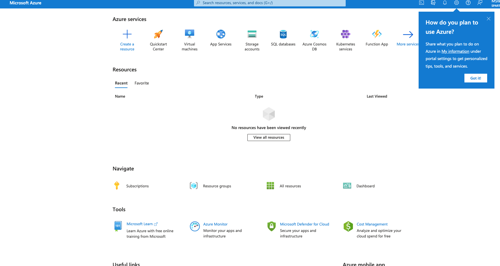
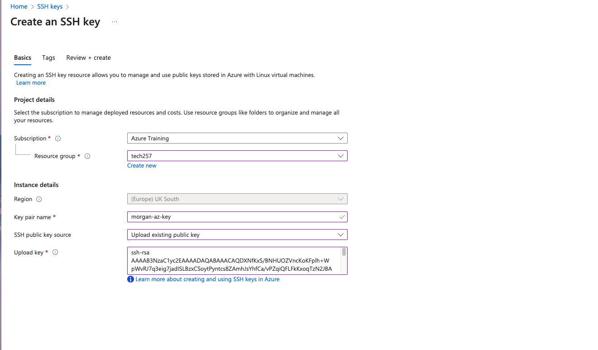

## Virtual machines - how with work with your own diagram

## How to login to Azure
The portal can be accessed below
[portal.azure.com](aws.amazon.com/partners/success/nasa-image-library/)



First we a generated new key.
``` 
 ssh-keygen -t rsa -b 4096 -C "m.scarlettstewart@gmail.com
cat test_again_key.pub
``` 
**insert terminal pic***

# <center> Setup SSH key on Azure <center>
Next, I created a key on Azure: Below are the steps.


<br>
As you can see below, I have opted to upload an existing key - the one we made earlier. It is important that we insert the correct RSA into the box, with no whitespace.
<br>



<br>

My key has been validated as can be seen in the picture below.


Below we can see that my key has now been, titled morgan-az-key.


## How to create a VM

## How to SSH into your VM

## How to delete to a VM


``` 


#stop vm when you no longer need
``` 