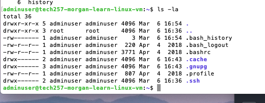
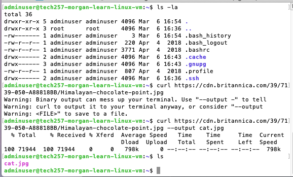
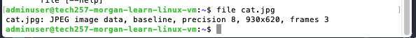
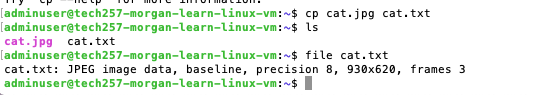
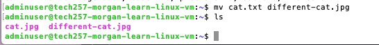
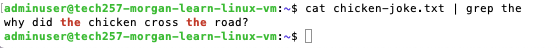
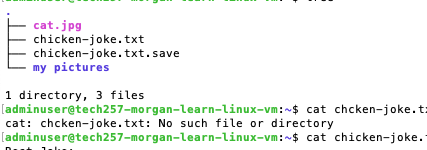
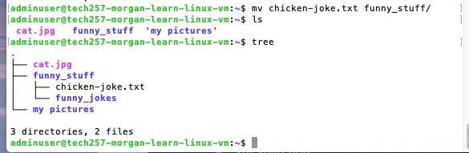
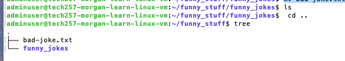
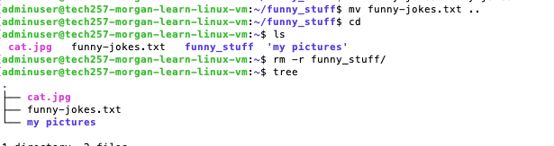

# LINUX

- [LINUX](#linux)
    - [How to find out where you are: Present Working Directory.](#how-to-find-out-where-you-are-present-working-directory)
    - [how to find out user](#how-to-find-out-user)
    - [how to list files](#how-to-list-files)
    - [how to list hidden files](#how-to-list-hidden-files)
    - [How to disconnect from vm (if you are on)](#how-to-disconnect-from-vm-if-you-are-on)
    - [How to see what commands you have used.](#how-to-see-what-commands-you-have-used)
    - [to run an old command in history eg. in your history command 5](#to-run-an-old-command-in-history-eg-in-your-history-command-5)
- [  Navigating files and folder ](#--navigating-files-and-folder-)
    - [Root vs Home](#root-vs-home)
    - [Curl](#curl)
- [rename file](#rename-file)
- [removing file](#removing-file)
- [Help](#help)
- [Remove](#remove)
- [Making files with spaces in them](#making-files-with-spaces-in-them)
- [Grep](#grep)
- [Update and upgrade](#update-and-upgrade)
- [Tree](#tree)
- [Move a file](#move-a-file)
- [minitask](#minitask)
- [find out details about your operating system](#find-out-details-about-your-operating-system)
- [how to get date:](#how-to-get-date)

### How to find out where you are: Present Working Directory.
``` 
pwd
``` 

###  how to find out user
``` 
whoami
``` 
###  how to list files

``` 
ls
``` 
###  how to list hidden files

``` 
ls -a
``` 

### How to disconnect from vm (if you are on)
Doesn't stop vm, just disconnects.

``` 
exit
``` 

Bash

Bash is an abbreviation for Bourne Again Shell
cat /etc/shells
ps -p $$ <-- shows you the processes>


### How to see what commands you have used.
it will keep the history even if you log out and back in


``` 
history

# to clear history
history -c
``` 


### to run an old command in history eg. in your history command 5

``` 
!5
``` 

# <center>  Navigating files and folder <center/>

cd . <- means current folder

###  Root vs Home
to get you back to **home** directory
``` 
cd 
cd ~ <-- can also be done
``` 

If at beginning means you are at the root of the directory
``` 
/ 
``` 
will get you to **root** directory
``` 
cd /
sudo su  
exit <-- will take you back to admin user>
``` 

 *****************add exit super user**********
####???

``` 
ls -la
ls -l if you just want non hidden files
``` 
As you can see below, the listings  that start with d on the left hand side are directories, whilst the ones with "-" are files.



### Curl

used to transfer data

``` 
curl https://cdn.britannica.com/39/7139-050-A88818BB/Himalayan-chocolate-point.jpg
``` 

you are asking the terminal to put binary on the screen, this wiil not work. But if we try to save the file like below, it should work

curl https://cdn.britannica.com/39/7139-050-A88818BB/Himalayan-chocolate-point.jpg --output cat.jpg

we can check with a quick ls. it will show us cat.jpg exists



we can also check the file type with file 
``` 
<filename.filetype>
``` 



copy a file from one filetype to another
``` 
cp cat.jpg cat.txt
``` 





We can see from an ls it is made, but from a file type command it still sees it as a jpeg.


# rename file

``` 
cp cat.jpg cat.txt
``` 


# removing file
``` 
rm different-cat.jpg
``` 


``` 
# make a directory(folder)
``` 
mkdir my pictures # <-- will make two folders because there is a space 
``` 
mkdir my_pictures
``` 
# Help 

if we wanted to delete,

the two folder you may have made with mkdir my pictures you can do

rm --help
<command need help with> --help


# Remove

The rm command is used to remove files you no longer need.
``` 
rm -r my <-- a little dangerous, better to manually delete file.

rm -i <directoryname>/* <-- if you have a directory you can delete every file 1 by 1, as each name appears, type y for yes, to keep it just press enter instead.
``` 
# Making files with spaces in them

```
mkdir "my pictures" <-- how to get a folder with a space, but not recommended. 

cd my\ pictures <-- is another alternative to get there

###  How to create a file
``` 
touch <filename>.<filetype>
``` 
``` 

head -2 chicken joke.txt
tail -2 chicken-joke.txt
nl chicken-joke.txt <-will print out all lines 
cat chicken-joke.txt


# Grep
``` 

***what is grep???*** 

cat chicken-joke.txt | grep the <--will print all the places with the word "the" in it>
``` 



# Update and upgrade
would usually run these one after the other on a vm when beginning. But NEVER on a production vm without permission.
``` 
sudo apt update -y
sudo apt upgrade -y
``` 

# Tree

Tree allows us to visually see our directory/file set up.



# Move a file

mv chicken-joke.txt funny_stuff/



move chicken joke back to home directory
mv funny_stuff/chicken-joke.txt .
mv funny_stuff/chicken-joke.txt home <-- tried this but it renamed it and moved it>


#MOVE CHICKEN JOKE TO FUNNYU JOKE
mv home funny_stuff/funny_jokes/


#rename chicken joke to badjoke.txt
mv chicken-text.txt bad-joke.txt

move badjoke from funny jokes to funny stuff
``` 
# A few different ways:
mv bad-joke.txt ..
mv bad-joke.txt ~/funny_stuff
```
 

remember one dot is where you are currently 2 dots are to go previous
# minitask


backup(move) funny joke to home directory
```
mv funny-jokes funny-jokes.txt
```
remove funny-stuff folder

```
get yourself to home directory
rm -r funny_stuff/
```



* note that mv renames and moves

to leave, exit on terminal then stop machine on azure console.

# find out details about your operating system

```
uname
uname -a # gives you more details
uname --all # gives you more details
```
# how to get date:

```
date
```