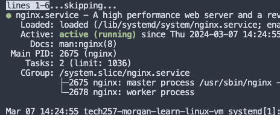
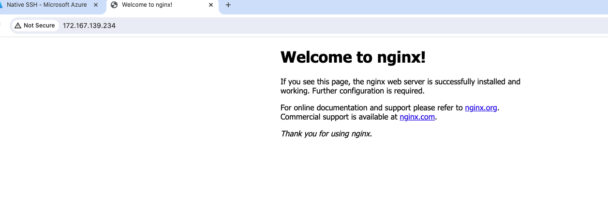
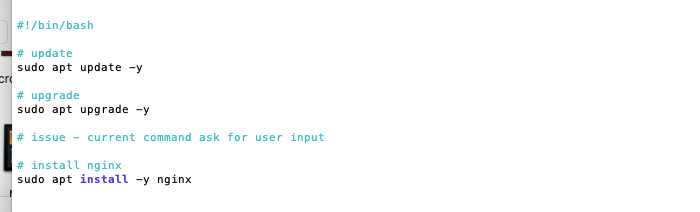
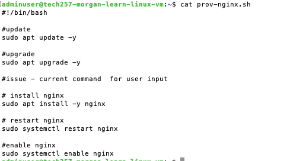
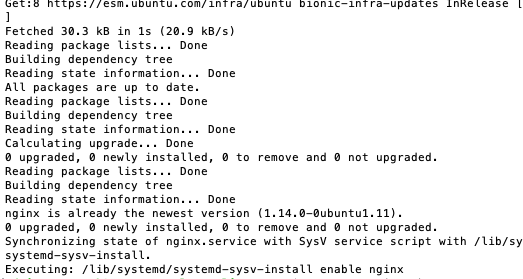
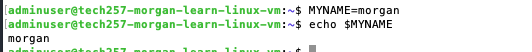
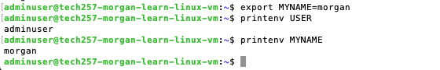
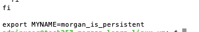
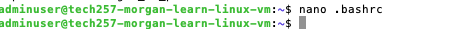

- [make an](#make-an)
- [sudo apt install](#sudo-apt-install)
- [sudo apt install](#sudo-apt-install-1)
- [Environment Variables](#environment-variables)
- [making my own VARIABLE TO STORE AND RETIEVE](#making-my-own-variable-to-store-and-retieve)

make a script that is starts a webserver.
# make an
touch prov-nginx.sh
nano into it
shebang.

#! /bin/bash <--put shebamg in> must go at beginning of every script file
# sudo apt install
# sudo apt install
must be next few lines

sudo systemctl  status nginx <-- 

control c <-- how to get out of it

chmod +x prov-nginx.sh <--- give executable permissions>

./prov-nginx.sh <--running our script

# Environment Variables

values stores in memory that are accessible to different softwares and tools 

printenv USER

printenv
# making my own VARIABLE TO STORE AND RETIEVE
MYYNAME=morgan

TO MAKE MY OWN ENV VARIABLE
use 
export env_var=input
then you can 
printenv env_var

The problem is this doesn't persist! if you close and come back it will not be there.

we need to change in the bash file.

We then need to reload the file to make it up to date, we can do it with the command:

source .bashrc

it is now truly persistent!