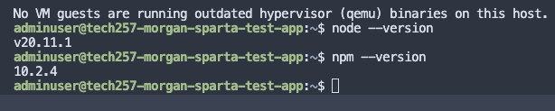
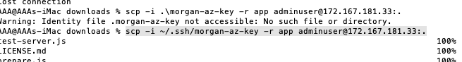
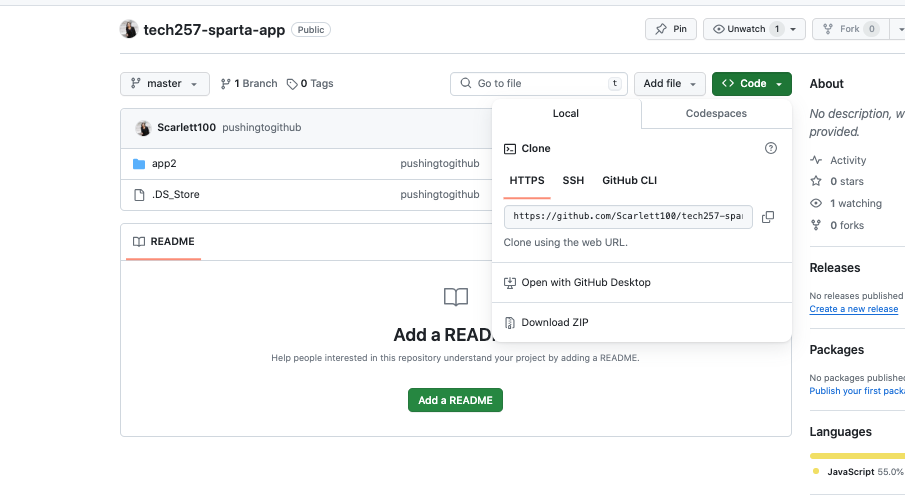
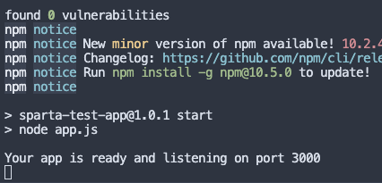
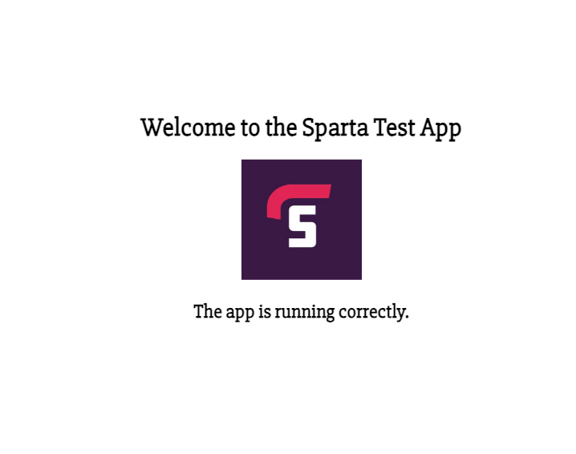
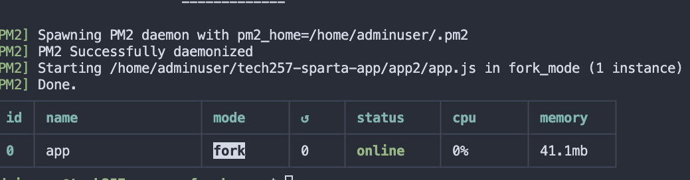
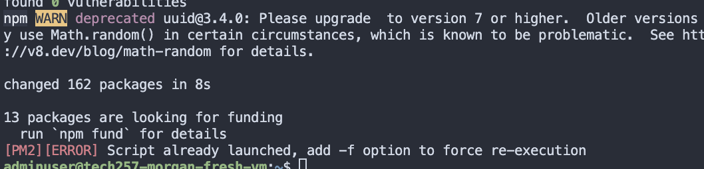
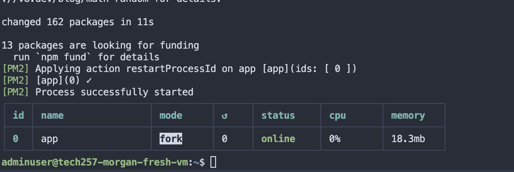

# DEPLOYING APP


# SSH INTO VM


# PLAN SCRIPT.


TWO STEPS: <br>
    - manually , working commands, must work without user input <br>

    - automate with a bash script
on Azure vm, we will need:
1,. Ubuntu 22.04 LTS -DONE
1. UPDATE & UPGRADE (ISSUE1. WITH USER PROMPT WITH UPGRADE COMMAND - NOT AN ISSUE ON 22.04)
      1. #update
        sudo apt update -y

        #upgrade
        sudo apt upgrade -y


#  INSTALL WEBSERVER -NGINX (ENSURE IT IS ENABLED)
# install nginx
```
sudo apt install -y nginx
```

# restart nginx
```
sudo systemctl restart nginx
```

# enable nginx
```
sudo systemctl enable nginx
```

# check status < not needed in script>
systemctl status nginx

3. right version of Node JS version 20.x (automatically will install npm) issue2 FIND OUT
```
https://deb.nodesource.com/setup_20.x | sudo -E bash - &&\
sudo apt-get install -y nodejs
```


4. right version of node js 


1. ‘app’ folder with code - ISSUE 3 FIND OUT TO COPY APP FOLDER TO VM
2. in app folder, we need to do 2 commands:
```
    1. npm install
    2. npm start OR node.js
```


log out of vm
run command to copy app folder to virtual machine:

The scp command can be run to copy files from one folder to another, it takes quite a while.
```
scp -i /c/Users/username/.ssh/private_key -r /c/Users/username/Downloads/app username@public-ip:/path/to/save

scp -i ~/.ssh/morgan-az-key -r app2 adminuser@172.167.181.33:.

after the -i you must give keypath to private key <br>
r is recurssive 
folder to copy
log in as user and ip
automatically goes to home folder
. means putting the file in current directory (pwd)
```



rsync seemed to be a quicker version, however, I came up with some difficulties,as it did not show on my vm, so went back to scp, which took some time. However, if you did want to use rsync the below would work.

```
rsync -avz -e "ssh -i ~/.ssh/morgan-az-key" ./app2 adminuser@172.167.181.33:.:.
```

After app has copied do npm install, then npm start npm --version within app folder


To then check that this works put the following into your broswer and you should get the below:

* <ip_address: 3000>

You should then get a page that shows Sparta.


## git way
run this

# 1. make a repository

tech257-sparta-app

* git init in repo and push repo to git.

git remote add origin https://github.com/Scarlett100/tech257-sparta-app.git
git branch -M master
git push -u origin master

to copy onto vm we will clone using https.


put the script in the vm
```
chmod +x deploy.sh <--- give executable permissions>
./deploy.sh <--running my script
```

![alt text]<br>

as you can see below, the app is running correctly once i put the IP address followed by port 3000.
```
the <ip_address>:3000
```



If running manually no need to do pm2.

it is important that we restart nginx because sometimes we may make changes to nginx and if 


So to make sure pm2 runs in background, you should #npm start line otherwise it will not run in background. when you have pm2 properly running in background, your terminal will look like this once done.



I must now find a way to add to my script to make sure pm2 strops running if already running.



To do that I had to do : 

```
pm2 stop app.js
```
