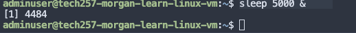
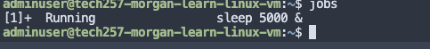
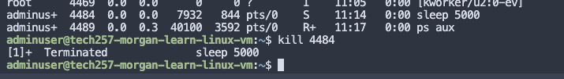
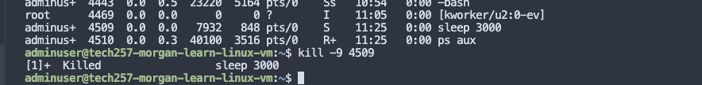

# Processes

- [Processes](#processes)
  - [Show us the user processes](#show-us-the-user-processes)
  - [To see all processes](#to-see-all-processes)
  - [To get process details in detail: To remember](#to-get-process-details-in-detail-to-remember)
- [Top](#top)
- [sleep](#sleep)
- [kill](#kill)


A process is the execution of a program, a process running in memory.

single core can process one thing at a time, but is very quick.

user processes and system processes
not every process is associated with a terminal

## Show us the user processes

```
ps
```


## To see all processes

```
ps -e
or
ps -A
```

## To get process details in detail: To remember

```
ps aux 
```

# Top

By default it updates every 3 seconds and shows the proceses ranked by amount of CPUMMM
```
top

# shift M (capital) to get ranked by memory useage 
# shift N to see processes ranked by ID 
# shift P to see CPU useage  (however this is the screen you get when you type top)
# q to quit
```


# sleep 
puta your terminal to sleep for a number of seconds, amy want to pause something

eg. if we wanted to put it to sleep for 3 seconds
```
sleep 3
```
if you want to run it in the background and not engage the terminal 
```
sleep 5000 &
```



jobs shows us what is running in background


# kill
There are 64 levels of kill.

lets say we want to kill our sleep in the background process
ps aux to find process ID
kill 4484

Just use the default which just terminates.

But if you absolutely must and no other option is viable, then use the brut force kill. You will notice below the process has now been killed as opposed to terminated.

```
Kill -9 process_id
```



pm2 is a way to manage the node app running in the background.

ypu don't kill an app directly, you go to pm2 to kill the app directly

use the diagram parent/child process in notes.

whats a child, parent process
zombie process
what is a process?