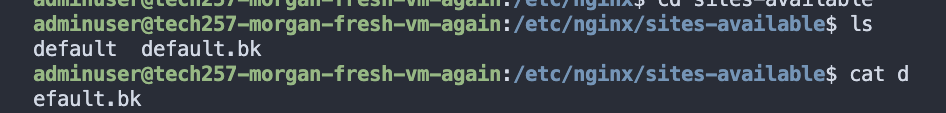
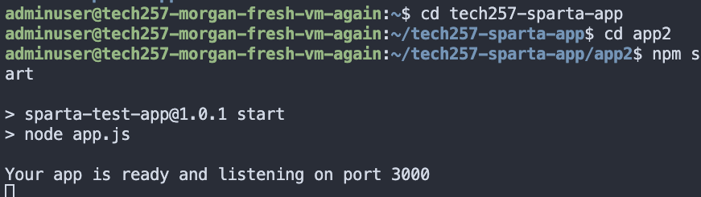
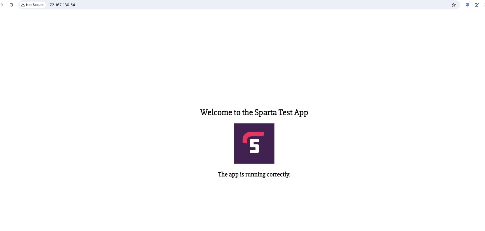

# Reverse Proxy Manually


To find where the default file is:
```
/etc/nginx/sites-available/
```
2. Copy the default file in case of any issues, i have made a backup with the bk file
```
sudo cp default default.bk
```


Then make a simple change in the default file changing the:

```
try_files $uri $uri/ =404;

to 

proxy_pass http: //127.0.0.1:3000 

the 127.0.0.1 means this computer.
```
It must be remembered to do with sudo priveledges to be able to access file. Once saved, you can go back to the home of the repo and restart ngix to recognise the changes: 
```
# Restart nginx
sudo systemctl restart nginx

# Enable nginx
sudo systemctl enable nginx
```
in the folder the app resides in run:

#npm start 
if you have yet to install npm, an
npm install will be needed beforehand.

Once succesful you will get the below message:



and you can go to your browser and enter your azure ip (not the 127.0.0.1) entered in default and you will get the below:




To automate it within our script we must put the below after we install :

sudo sed -i "s|try_files .*;|proxy_pass http://127.0.0.1:3000;|g" /etc/nginx/sites-available/default

# To test on a new vm with ramon's image
We swapped out this line with the original update command to:

```
sudo DEBIAN_FRONTEND=noninteractive apt-get upgrade -yq
q means quiet (less command on screen, so can be taken out)
```

and script will show:


We then entered it into user data in our vm,by going onto the advanced tab and entering there so that it is automated completely and after a while (we did at first recieve a bad gateway) it loaded and we got the below. It is very important that you do not edit script after pasting into user data. in the updated script we also did a cd into root to avoid any issues.


