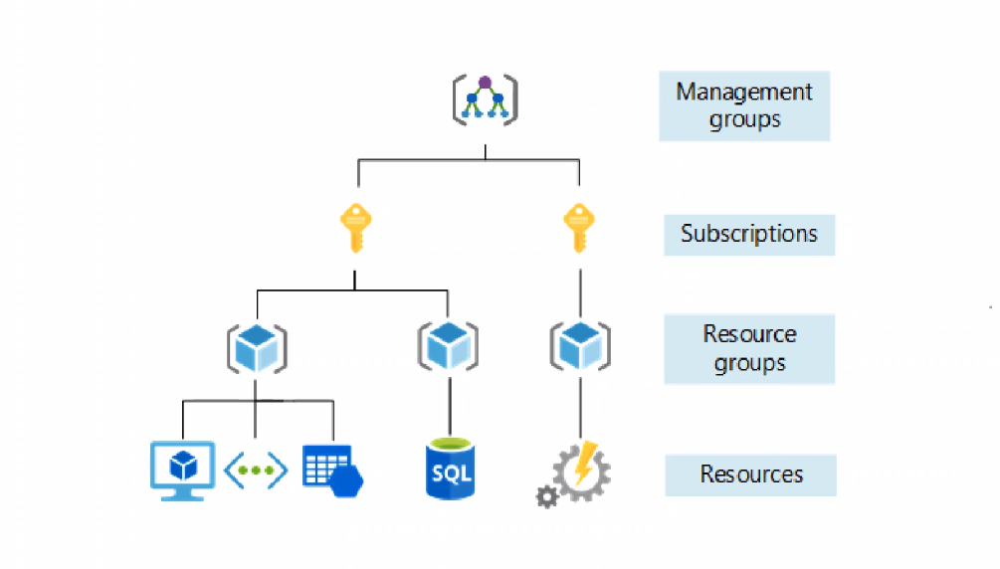

# 
The basics of Azure

Azure, is the microsoft platform for cloud computing. It is an equivalent of AWS.

Azure regions and availability zones: how they work and include up-to-date diagrams to help

Regions: A region is a geographical area that contains one or more data centers. Each region is independent and has its own set of services, resources, and network infrastructure.

An availability zone is a physically separate data center within a region that is designed to be available and fault tolerant.Azure has at least three availability zones in each region and defined by unique name as "Zone 1" or "Zone 2".

## How is Azure structured/organised (resources you create on there)?

##  
 simple architecture 

root management group: different scopes, at each level, can set access + policies.
different scopes eg. At each level, can set access and policies. both access and policies restrict what a user can do, just differently.
Management groups are like folders - 6 levels.
Resource groups are like containers
subscriptions separate payment accounts. But subscriptions have limits/quotas. eg. only 50x vm's.

##  
 More complex architecture 

### 
 1. Cloud Computing Models: 

Infrastructure as a Service (IaaS): This category provides on-demand virtual computing resources.Rent the computer building blocks (VMs, storage, networking) on-demand with IaaS. You control them directly, like building with Legos in the cloud! You have a lot of control over the underlying infrastructure.

Platform as a Service (PaaS): Tools like Azure App Service, Azure Functions, and Azure Kubernetes Service (AKS) allow you to build, deploy, and manage applications without managing the underlying infrastructure. Imagine a like a pre-built kitchen where you just focus on cooking (your code). No need to worry about setting up the  appliance (infrastructure).

Software as a Service (SaaS):  This category provides access to pre-built applications hosted by Microsoft & are accessed through a web browser or API and cover various functional areas like CRM, analytics, and productivity tools. Imagine renting software or a subscription rather than purchasing.

### 
 2. Core Services: 

These services form the foundation for building and deploying cloud solutions on Azure. They include:

Compute: Services for creating and managing virtual machines (a powerful, portable pc inside of a pc), containers (a house to store everything), and serverless functions(code that runs on-demand).   

Storage: Solutions for storing data in various forms, including blobs, disks (documents), databases, and archival storage.
 
Networking: Tools for creating and managing virtual networks, firewalls, load balancers, and other network components. An easy way to remember networking is like a bridge or a highway, connecting you to different cities. In this situation it is connecting to different parts of the cloud whilst controling who has access to what through the firewalls and load balancers.

 
Databases: A variety of managed database services, including relational databases like SQL Database and NoSQL databases like Cosmos DB and other options for different types of data. An easy way to remember databases is like  a very organised filing cabinet.

3. Other Service Areas:

Beyond the core services, Azure offers a vast range of additional services catering to specific needs:

Machine Learning and Artificial Intelligence (AI): Services to build, train, and deploy machine learning models and leverage AI capabilities.
 
Internet of Things (IoT): Tools to connect, manage, and analyze data from IoT devices.
 
Migration and Management: Services to assist with migrating existing workloads to Azure and managing them effectively.
 
Security: A comprehensive suite of security services for protecting your data and applications in the cloud.
 
Data Management and Analytics: Tools for storing, managing, and analyzing large datasets.
 
Development and Integration: Services to streamline development workflows and integrate different applications and services.

For DevOps: For private companies with very granualr security, for example CI/CD or IAC.
## What types/categories of services does Azure provide?

# 
 The Azure Pricing Calculator? 

********* what is it***********************

You should use the Azure Pricing Calculator for several reasons: 

## 
 Before deploying to Azure: 

* **Cost estimation and budgeting**:    
    * primary use case.  
    * calculator helps you estimate the potential costs for specific Azure services for your use case. 
    * Gets you a breakdown of costs once you enter resources such as instance types, database needs etc. 
    * Can now plan and adjust cloud budget realistically and accurately. Allowing for informed decisions. 
    * So there are no suprises!
  * 

* **Service Comparison**:   
    * The calculator allows you to compare pricing options for different Azure services. Helpful to see what works for you.

* **Identifying potential savings**:  
    * The calculator presents possible opportunities to optimise your costs. 
    * Possibly show you  more cost-effective service tiers or pricing models based on your usage patterns. eg. using spot instances for flexible workloads.

## 
 After deploying to Azure (for existing customers): 

* **Cost monitoring and analysis**:      
    * While the calculator is primarily for pre-deployment estimates, it can also be used to analyse existing Azure costs. 
    * If you're already using Azure, you can log in with your billing account to see a more precise cost breakdown based on usage. 
    * This helps you identify areas for potential cost reduction
    

