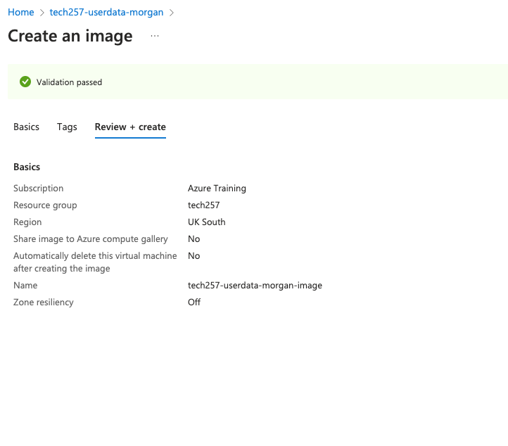
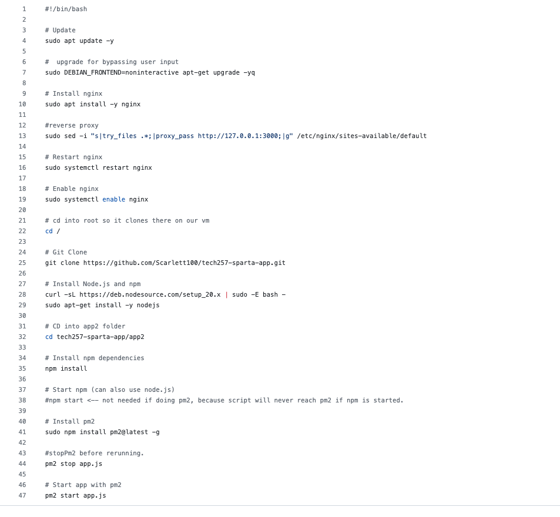
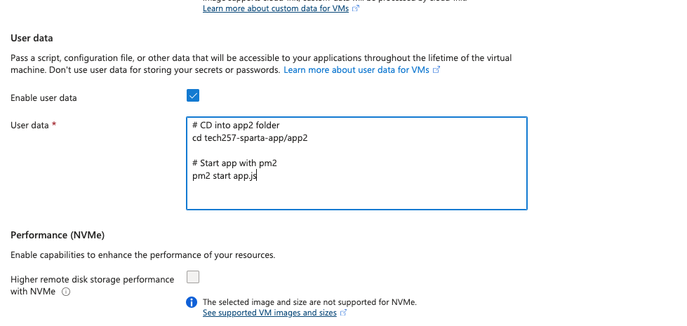

# <center> Creating an vm from an image and getting the app to run with a little user data <center/>
- [ Creating an vm from an image and getting the app to run with a little user data ](#-creating-an-vm-from-an-image-and-getting-the-app-to-run-with-a-little-user-data-)
- [script update](#script-update)
- [deprovision](#deprovision)
- [1. Create an image](#1-create-an-image)
- [2. Make sure dependencies are installed](#2-make-sure-dependencies-are-installed)
- [3. Create a new vm](#3-create-a-new-vm)
- [4. Import section of bash script](#4-import-section-of-bash-script)
- [5. Blockers](#5-blockers)
- [Update](#update)


# script update

First we made a vm and inputed user data. Below is my script:

``` 

#!/bin/bash

# Update
sudo apt update -y

#  upgrade for bypassing user input
sudo DEBIAN_FRONTEND=noninteractive apt-get upgrade -yq

# Install nginx
sudo apt install -y nginx

#reverse proxy 
sudo sed -i "s|try_files .*;|proxy_pass http://127.0.0.1:3000;|g" /etc/nginx/sites-available/default

# Restart nginx
sudo systemctl restart nginx

# Enable nginx
sudo systemctl enable nginx

# cd into root so it clones there on our vm
cd /

# Git Clone
git clone https://github.com/Scarlett100/tech257-sparta-app.git

# Install Node.js and npm
curl -sL https://deb.nodesource.com/setup_20.x | sudo -E bash -
sudo apt-get install -y nodejs

# CD into app2 folder
cd tech257-sparta-app/app2

# Install npm dependencies
npm install

# Start npm (can also use node.js)
#npm start <-- not needed if doing pm2, because script will never reach pm2 if npm is started.

# Install pm2
sudo npm install pm2@latest -g

#stopPm2 before rerunning.
pm2 stop app.js

# Start app with pm2
pm2 start app.js
``` 

# deprovision

Next once that was up and running and working we had too :

2. run the command to deprovision user
    sudo waagent -deprovision+user 
3. type yes


Next we had to stop the vm, and generalise the vm so that we could creae a new image.

this can be done manually on the interfaceor by running the command:
``` 
 az vm generalize --resource-group <yourResourceGroup> --name <yourVMName>
 ``` 


Our task was to be able to deploy an app with user data and with an image + a small amount of user data.

# 1. Create an image
 Firstly, we had to create a custom image named 
tech257-morgan-ready-to-run-app-image. 



# 2. Make sure dependencies are installed

Secondly, this image had to have all dependencies installed 
with the app folder somewhere off the root directory, eg. /repo/app:
we have done this via our script.:



# 3. Create a new vm
Thirdly, we had to create a new VM using the custom image we had created:


# 4. Import section of bash script
Next we had to use a small portion of your Bash script to paste into user data to:

cd into the app folder
run the app
The contents of my bash script can be found below
 ``` 
#!/bin/bash

# CD into app2 folder
cd /tech257-sparta-app/app2

#stopPm2 before rerunning.
pm2 stop app.js

# Start app with pm2
pm2 start app.js
 ``` 
 App running:
 As you can see below, the app is running!
 
 

# 5. Blockers
One of my big blockers was simply that in my script for my small user data input was that I forgot the shebang, so nothing worked and I could not figure out why, this took up a lot of time. finally after a while somebody in my group with the same issue, realised and we were all able to rectify our same issue.




# Update

So when asked to do this again I had difficulty getting it working, eventually I was able too by doing the following:

* Using the longer original script but inserting it as **user data** this time when making our first vm
* Next was to ssh into vm, as I found app didn't work
* Once I was ssh'd in I navigated to the app2 folder and ran two commands:
``` 
sudo pm2 kill
sudo pm2 start app.js
 ``` 
* Once this had been done, I decommissioned the cm using the below command and continued as normal to make an image. 
``` 
sudo waagent -deprovision+user
``` 

Next I made the new vm, off off my new image and was able to import the same code as section 4, which worked and gave me a working app as seen below.
<br>
