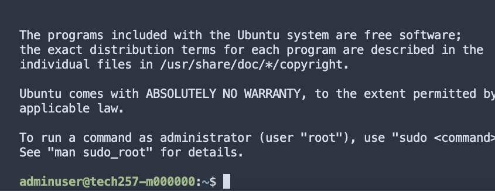

# <center> Scale sets <center/>


Scale Sets (SS) streamline the deployment and management of identical virtual machines (VMs) in Microsoft Azure. SS easily create a group of VMs that share the same configuration, automatically adjusting their number based on demand. This feature ensures high availability by distributing VM instances across multiple fault domains and update domains. Additionally, SS simplifies management tasks such as deploying updates and installing software across all VM instances simultaneously. It optimises costs by dynamically scaling the number of VMs to match workload demands, while Azure's built-in load balancing capabilities evenly distribute incoming traffic among the VM instances.
<br>
.png>)
Scale sets enable use to achieve high availability and scalability.

Firstly we need to navigate to scalesets within the azure search bar and once selcted click create. You will notice the firstpage is similar to our normal page when making a vm. For this task it was important that we chose the correct image, the one we had made ourselves.
<br>


<br>

Continuing to makeour vm it is important that we have port 80 and port 22 selcted as inbound ports to allow.
<br>

Port 80 and Port 22 are ports computers use to communicte and send and receive data. 
<br>
**Port 80**: <br>
* Data's  main entrance to come into your computer via the web.
*  Default web traffic port.<br> 
*  Connects to the web server hosting that site using port 80 when you visit a website. .

**Port 22**: <br>
*  The default port for all Secure Shell (SSH) connections. <br>
*  SSH is a secure way to access another computer remotely. <br>
*  Having Port 22 open allows you to connect to a remote server securely.


When you designate these ports for inbound traffic, you're essentially authorizing data to flow into your system through these channels. For instance, configuring a firewall or network security group to allow inbound traffic on port 80 lets your server accept web requests, while permitting inbound traffic on port 22 facilitates secure connections to your server via SSH.
<br>


## Load Balancers
Our Load balancer will have a special rule  that is you come in at port 50000, it will redirect you to port 80. if you click on the pencil next to the interface you will see out ports. Load balancers distribute incoming network traffic effectively across  backend servers or resources. Load balancers allow us to increase availability by distributing resources within and across zones.They also load balance external and internal traffic to Azure virtual machines whilst efficiently establishing outbound connectivity for vm's.
<br>


## SCALING:

When you expand the capacity or instance count of the scale set, it will incorporate additional virtual machines into the set according to the specifications outlined in the profile configuration. Within ours, we required a minimum of 2 at any one time and a maximum of 3. This meant that if there is a failure or unhealthy instance, it can failover without interuption to another instance.
<br>


## HEALTH:

We allowed for automatic repairs and indicated that our isntances could be marked as unhealthy for a maximum of 10 minutes  before it would be removed and another healthy vm created in its absence.
<br>


## Effective user data
<br>
As the dependencies were already on my image, I needed minimal user data. As seen below.
<br>

```
#!/bin/bash

# CD into app2 folder
cd /tech257-sparta-app/app2

#stopPm2 before rerunning.
pm2 kill 

# Start app with pm2
pm2 start app.js
 ```
<br>


Tags:
Personally, I like to locate my resources via tags, so this step it very important.
<br>


## My healthy Scaleset.
Below you can see that once created, my scaleset was marked as healthy, which is what we want.
<br>


# <center> unhealthy statuses<center/>
The user data runs on the provisioning of a vm, so when you restart the user data the vm won't reload the user data. Likewise, when you restart a scale set it just restarts the vm's associated. It must be remembered that user data only runs once. As you can see below when we restart our vm's are unhealthy: 
<br>

<br>
One way in which we can fix this is to **reimage** the scale set. **Reimaging** refers to going over the disk with a new image, imagine a fresh vm, a clean slate.
This is how we provision:<br>

<br>
You can see that as the update is running they have changed to healthy:
<br>

<br>
Now the status is restored to running:
<br>


<br>
If we refresh the load balancer ip we will find the app is back up, whereas before we got a bad gateway error.
<br>

If you want to get an unhealthy status again, you can restart instance, or start and stop instance. As you can see below I have restarted one instance and ended up with an unhealthy status:

<br>


# <center>  How to ssh into instance <center/>
Outside of the testing stage we shouldn't really ssh into our scaleset vm's.
But if we must one way to do it is to first click on the instance we need, for this example I will use the vm that we restarted and is unhealthy. Once we click on it we must ssh into it.
<br>

<br>
Once I put in my ssh details path it gives me a code to copy
<br>
 <br>
However it gives us a private ip, this would only work if we are on the same network.
<br>
As you can see below, I have ssh'ed inside:
<br>

```
ssh -i ~/.ssh/morgan-az-key -p 50000 adminuser@4.158.120.166

I had to put the port 50000 and the ip of the load balancer
```
<br>



However, when I try to ssh into the unhealthy instance by changing the port slightly:

```
ssh -i ~/.ssh/morgan-az-key -p 50001adminuser@4.158.120.166

I had to put the port 50001 and the ip of the load balancer
```
<br>

The connection is closed, because it has been unhealthy for more than 10 minutes

<br>
If we look back at the instances, the unhealthy one has dissapeared and we only have the first one, and now a new one, titled number 2.


<br>


#
If a vm doesn't work and it is still unhealthy after certain amount of time, the scale set will create a new one, as you can see below, scale set 1 has dissapeared and we are now left with 0 and our newly created number 2.
<br>


# How to delete a vm scale set
we will need to delete our vm's, disks, lb's, NSG's and public ip's.
There are two options:
1. If you have tags then you can go into your resource group and delete everything with a tag associated with the scale set, which is my personal preference so I do not miss anything.
2. You can manually select everything and begin to delete. The way in which to ne this would be to go to stop your scale set and duplicate the tabs 4 times then navigate to these tabs, do not delete until you have all these tabs open
   * First tab: the **scale set**, this will delete the vm's associated and the disks associated.
   * second tab :On the side menu scroll down to **load balacing**
   * Third: public ip. We cannot delete the public ip whilst the load balancer is still in action. Hence why we delete the load balancer first. To get to this page, go to the load balancer and click on the frontend ip address.
   * Fourth tab: navigate to **network settings** and click on your **network security group**
 * Note: if you cannot delete anything that should be able to be deleted please do a refresh.


