# <center>  Virtual machines <center>


A virtual machine can be thought of as a *"virtual computer within a computer"* according to Microsoft. Virtual machines require no physical hardware from the customer, other than a personal device, the portability of Virtual machines leads to many benefits including **cost reductions**, by only paying what you use, therefore introducing **scalability**. The ability to scale down if your workload requires a smaller instance and the ability to scale up if you require a larger instance at remarkable **speed** make virtual machines very attractive. The speed means that you can mov from one hypervisor to another on a different machine. This portability opens up global options and **lowered downtimes** Lastly, security in VM's are very high, you can set controls, and microsoft has its own settings built in. Virtual machines can be used for accessing virus infected data,backing up your OS, testing, deploying and apps to the cloud. Below we can see the architecture of a VM.

#### <center>  Azure VM Architecture <center/>

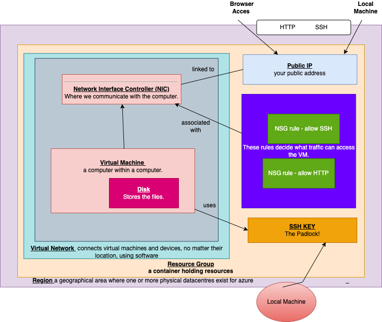

## How to login to Azure
The portal can be accessed below
[portal.azure.com](aws.amazon.com/partners/success/nasa-image-library/)
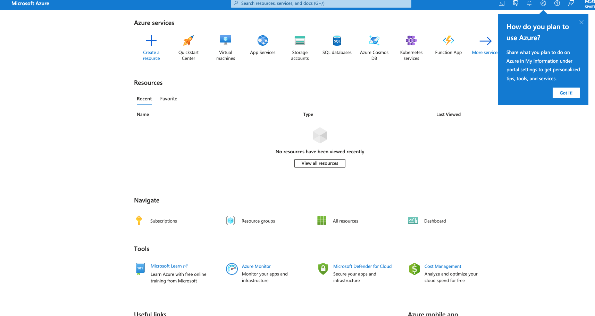


First we a generated new key. 
``` 
 ssh-keygen -t rsa -b 4096 -C "m.scarlettstewart@gmail.com
cat test_again_key.pub
``` 
**insert terminal pic***

# <center> Setup SSH key on Azure <center>
Next, I created a key on Azure: Below are the steps.

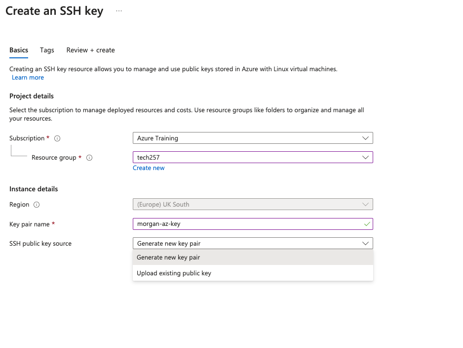

<br>
As you can see below, I have opted to upload an existing key - the one we made earlier. It is important that we insert the correct RSA into the box, with no whitespace.
<br>

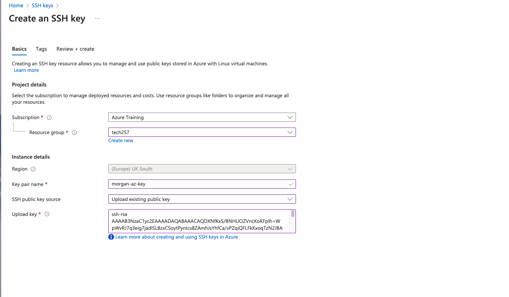

<br>

My key has been validated as can be seen in the picture below.
<br>

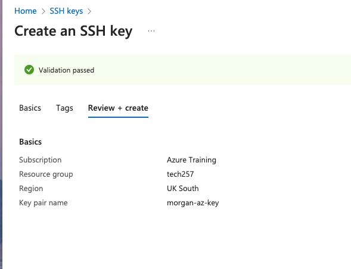

Below we can see that my key has now been, titled morgan-az-key.
<br>
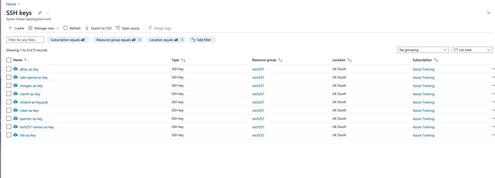


# <center> Creating a Virtual Machine <center/>


## <center>How to create a VM <center/>

On the homepage we can search for virtual machines's in the search bar. Once we are on this page we can choose our **Resource Group**, **Virtual Machine Name**, **Region**, **Security** and more. It is high;y importamt that we chose the region of **UK South** and the **Image** of **Ubuntu Pro 18.04 LTS x64 Gen2**. For our authentication - not shown in this picture - it is important we chose **SSH Public Key**.
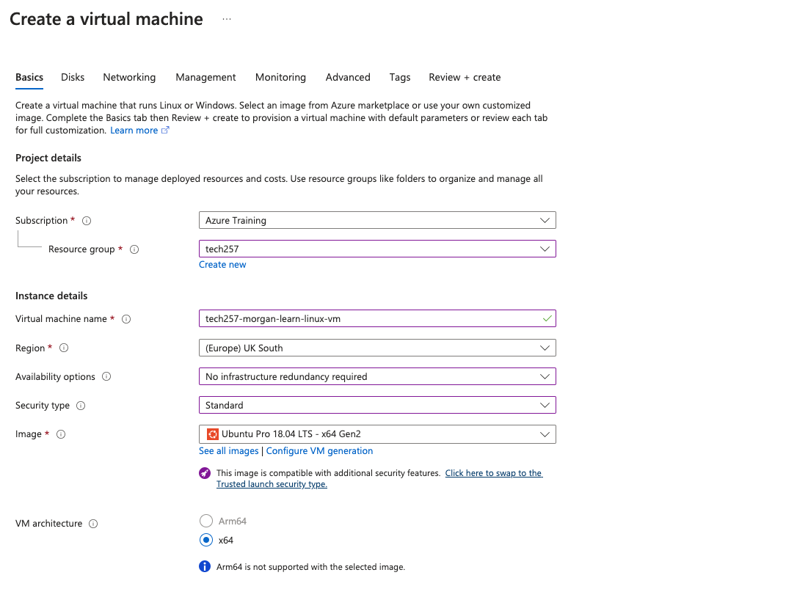

Next, it is ideal that we change our SSH Public Key Source to **"Use existing key stored in Azure"** and choose the correct stored key. Lastly, we will allow HTTP 80 AND SSH22.


## <center> Disks <center/>

Virtual machines on Azure have a temporary short term storage disk and one operating disk. You can however, add on storage later.

It is integral that Standard SSD is chosen as opposed to the default Premium, in order to reduce costs.

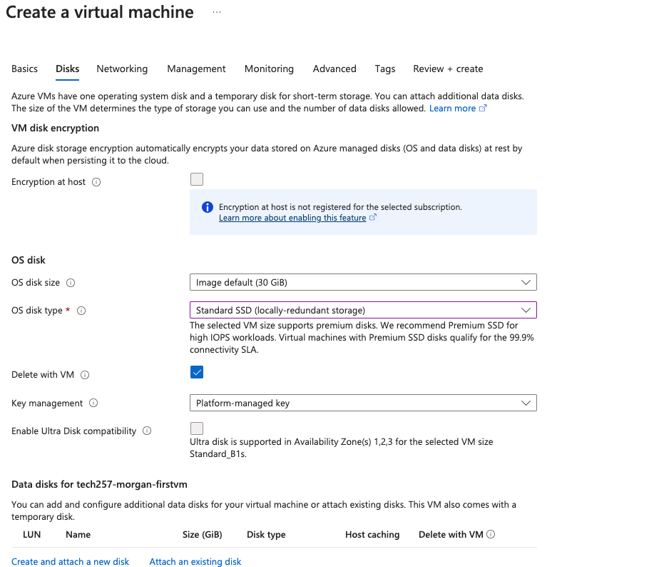

## <center> Networking <center/>

Here we can see the networking choices.


## <center> Tags <center/>

Tags can be seen as Key Value pairs that are applied to multiple resources whilst keeping the same tags. It can be helpful with consolidated billing.

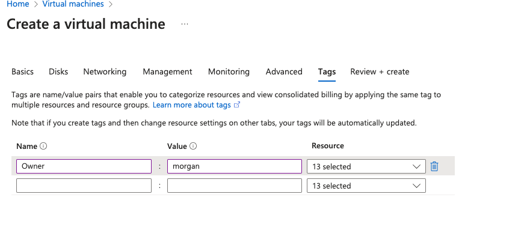

## <center> Creation! <center/>

Next we can see our VM has passed validation and it shows all the resources tags have been assigned too.

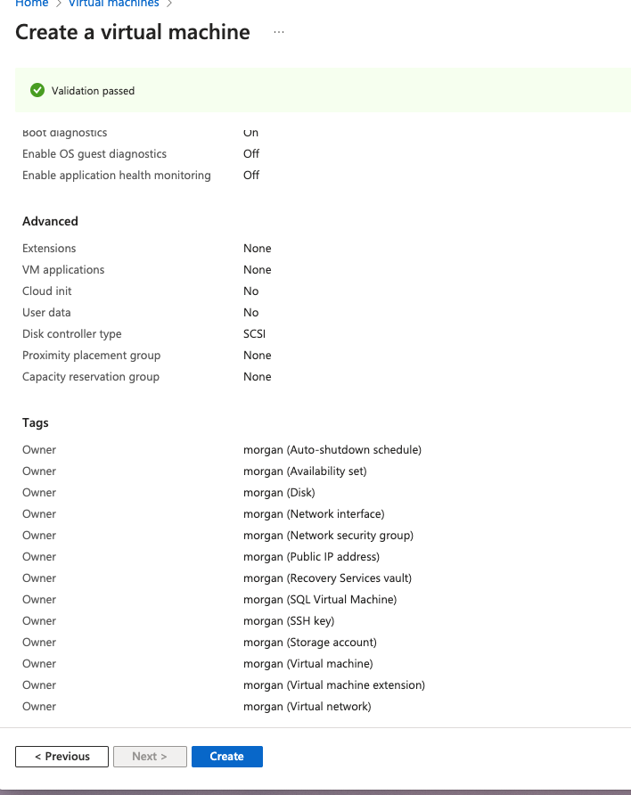

Finally we are deployed and ready to go! It must be remembered when making a virtual machine, upon deployment (creation) it will start.

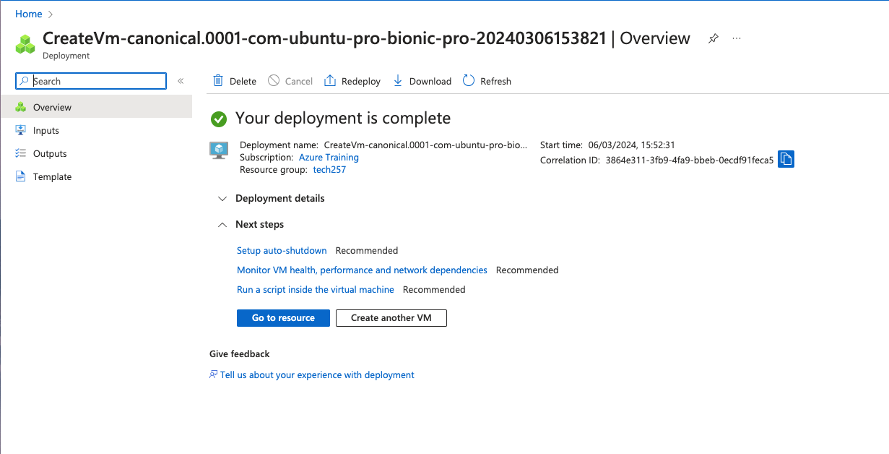

## <center> How to SSH into your VM <center/>

Once created you can connect to your VM by clicking connect in the top left corner and choosing the first option. You will then choose **"Native"**, and copy the second line of linux.


My command (done again at a different time to the command in screen above) was:
``` 
ssh -i ~/.ssh/morgan-az-key adminuser@51.140.53.132
``` 
As you can see at the bottom, we have been able to add this to list of known hosts and successfully connect.
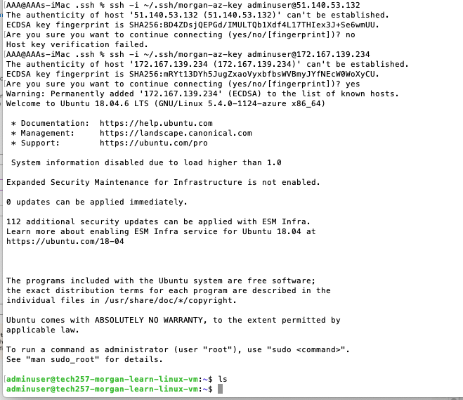


## How to delete to a VM

To delete a VM simply click on the resource and click  delete on the tool bar, it may take a few moments to action. 


