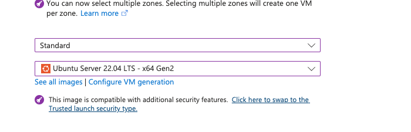

To create our virtual network we began by creating a virtual machine and creating it whilst creating the vm.

firstly we chose a Ubuntu Server 22.04 LTS x64 Gen2

next up, it is time to create our virtual networks:  

# we added security groups:

custom port 3000 and HTTP port 80.

#

Once we have chosen all components we can see the setup, because we made ours whilst making a vm, we also recieve those details.

